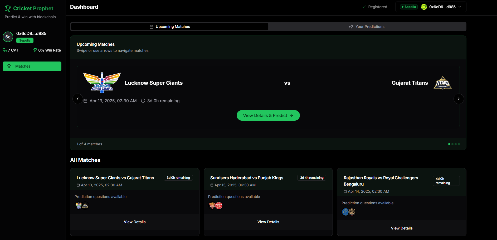
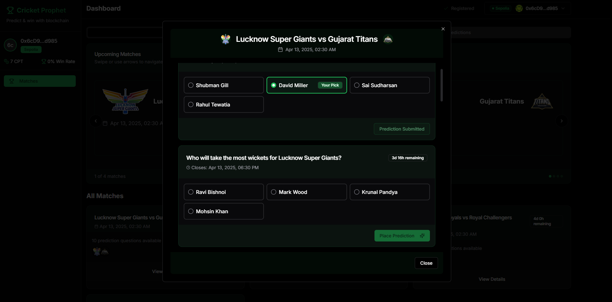
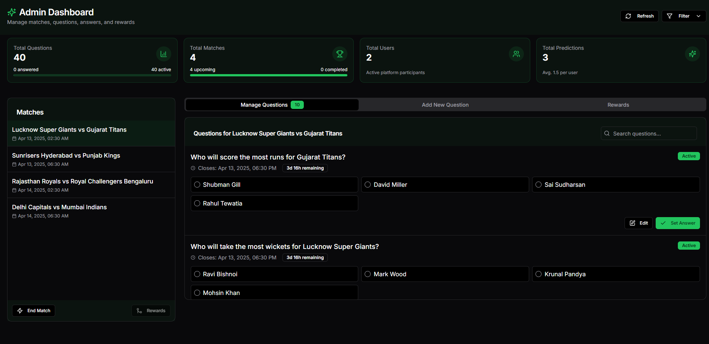

# 🏏 CricketVoteCrypto

**CricketVoteCrypto** is a Web3-powered IPL prediction platform where users participate in match-based prediction questions and earn **CVT (Cricket Vote Token)** as rewards. The platform merges fantasy cricket and decentralized Web3 technology, ensuring transparent, fair, and community-driven match predictions.

Users connect their MetaMask wallets, vote on real-time IPL match questions using CVT tokens, and claim rewards based on prediction accuracy — all handled by smart contracts and Merkle tree proofs to ensure trust and scalability.

---

## 🔥 Highlights

- ✅ **Web3 Authentication via MetaMask**
- 🎯 **Vote on real-time IPL match questions**
- 🏆 **Merkle-based fair reward system**
- 📈 **Gamified stats and leaderboard**
- 🧑‍💼 **Robust Admin Panel**
- 💸 **Earn & claim CVT tokens through smart contracts**

---

## ⚙️ How It Works

1. **User signs up** using MetaMask and receives **10 CVT tokens**.
2. **Admin creates prediction questions** for IPL matches (e.g., *"Will there be a six in this over?"*).
3. Users vote on predictions before the deadline using their tokens.
4. After the match, the **admin marks correct answers**.
5. A **Merkle tree** is generated of all correct users and the **Merkle Root is pushed on-chain**.
6. Users claim rewards by submitting **Merkle Proofs** to the contract.

> 🔐 Only the Merkle Root is stored on-chain, making it efficient and secure.

---

## 🛠 Tech Stack

- **Frontend:** Next.js, Tailwind CSS
- **Smart Contracts:** Solidity (ERC-20 + Merkle reward logic)
- **Blockchain:** Sepolia Ethereum Testnet
- **Wallet Auth:** MetaMask
- **Database:** MongoDB
- **Tools:** Ethers.js, Hardhat (optional), Merkle Tree JS

---

## 🖼 Screenshots

### 🏠 Home Page & Dashboard  

Users view upcoming matches, vote on predictions, and see their CVT balance.



---

### 📊 Prediction Interface  

Real-time match questions appear here — users can vote with CVT tokens.



---

### 🧑‍💼 Admin Panel  

Admins manage matches, questions, results, and generate Merkle roots.



---

## 📦 Installation & Usage

### 🔧 Prerequisites

- Node.js v18+
- MetaMask Extension
- MongoDB (local or cloud)
- Sepolia ETH for wallet testing

### 📥 Setup

```bash
# Clone the repo
git clone https://github.com/yourusername/CricketVoteCrypto.git
cd CricketVoteCrypto

# Install dependencies
npm install
